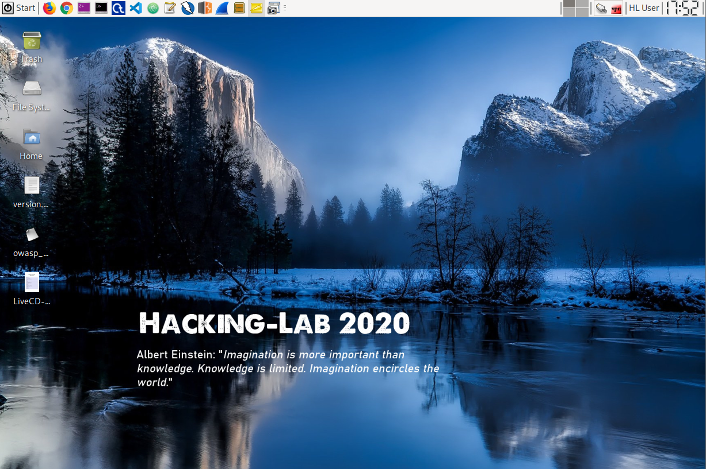

# Hacking-Lab LiveCD
The Hacking-Lab LiveCD is based on the official (latest) Kali Linux. It comes with a pre-configured XFCE desktop and some usefull additional Hacking-Lab extensions. 

## Installation
Please follow the livecd installation instructions in ENGLISH, GERMAN or FRENCH langugage. 

* ENGLISH [Markdown](./guides/install-livecd-en.md) or [PDF](./guides/install-livecd-en.pdf)
* GERMAN: [Markdown](./guides/install-livecd-de.md) or [German](./guides/install-livecd-de.pdf) 
* FRENCH: [Markdown](./guides/install-livecd-fr.md) or [French PDF](./guides/install-livecd-fr.pdf)

## Screenshot

