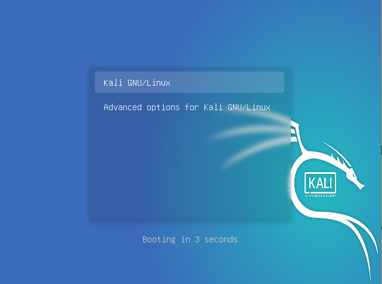
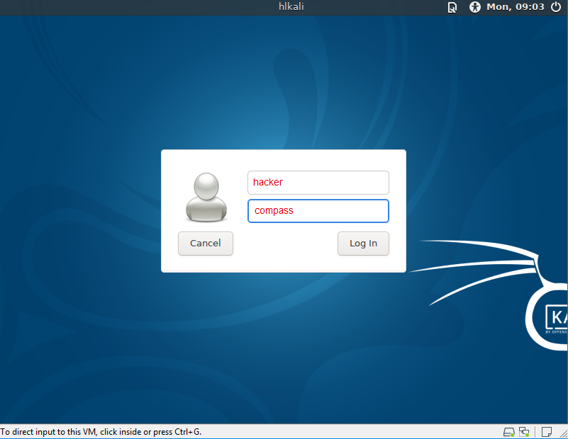

# Kali Linux based LiveCD for Hacking-Lab
This XFCE livecd is based on the official (latest) Kali Linux with some Hacking-Lab extensions. You can use a native Kali Linux instead of this distro. 

## Installation Guides in ENGLISH, GERMAN, FRENCH
* Markdown [English](./guides/install-livecd-en.md) [German](./guides/install-livecd-de.md) [French](./guides/install-livecd-fr.md)
* PDF [English](./guides/install-livecd-en.pdf) [German](./guides/install-livecd-de.pdf) [French PDF](./guides/install-livecd-fr.pdf)

## Booting the LiveCD

* Please use the username `hacker` with the password `compass`. 
* This use is in the sudo user group. 
* Gain root by entering `sudo -i` in a terminal

* This is how the XFCE Desktop looks like
* Original Kali Linux with some HL extensions

