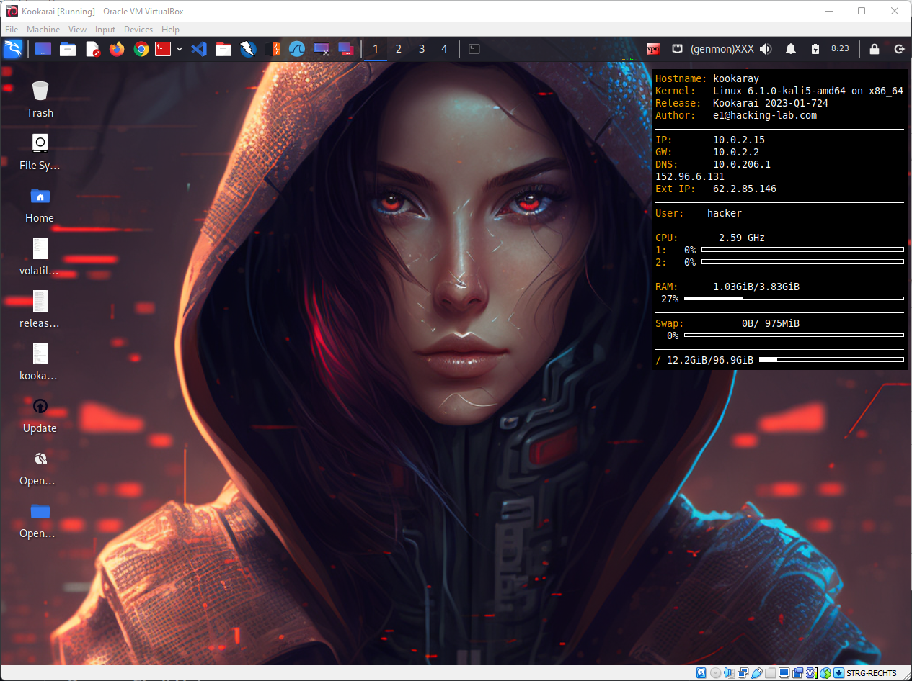

# Hacking-Lab Kookarai Pentesting Linux
The Hacking-Lab Kookarai Pentesting Linux is based on Kali Linux. It comes with a pre-configured XFCE desktop and some usefull additional Hacking-Lab extensions. 

## Installation
Please follow the Kookarai Pentesting Linux installation instructions in ENGLISH, GERMAN or FRENCH langugage. 

* ENGLISH [Markdown](./guides/install-kookarai-en.md) or [PDF English](./guides/install-kookarai-en.pdf)
* GERMAN: [Markdown](./guides/install-kookarai-de.md) or [PDF German](./guides/install-kookarai-de.pdf) 
* FRENCH: [Markdown](./guides/install-kookarai-fr.md) or [PDF French](./guides/install-kookarai-fr.pdf)

## Screenshot Kookarai Pentesting Linux Desktop

## Login Credentials
* Username = `hacker`
* Password = `compass`

## OpenVPN HL 2.0
If you need a reverse-shell from one of the vulnerable services back to your local computer, you must connect to our vulnerable systems using [OpenVPN](https://github.com/Hacking-Lab/hl2-openvpn-ost.ch). The vulnerable services are firewalled and therefore you cannot connect back to an internet ip address. 

## Reverse Shell Video
* https://www.hacking-lab.com/blog/reverse-shell-vpn

**IMPORTANT** You must be authenticated to one of our HL2.0 web applications. Without being authenticated, VPN will not work. 

## More Information
Please visit https://www.hacking-lab.com/blog/ to learn more about using Hacking-Lab. 

