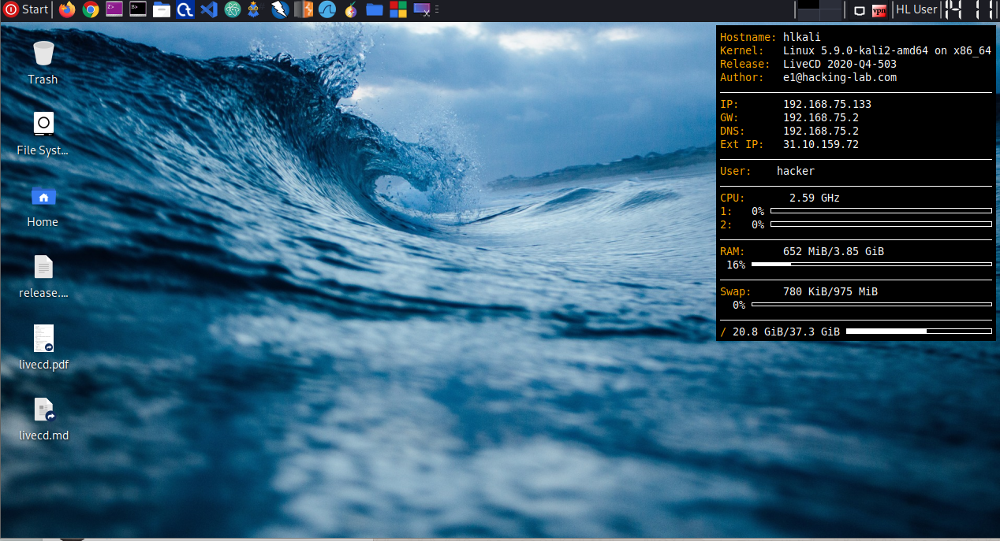

# Hacking-Lab LiveCD
The Hacking-Lab LiveCD is based on the official (latest) Kali Linux. It comes with a pre-configured XFCE desktop and some usefull additional Hacking-Lab extensions. 

## Installation
Please follow the livecd installation instructions in ENGLISH, GERMAN or FRENCH langugage. 

* ENGLISH [Markdown](./guides/install-livecd-en.md) or [PDF](./guides/install-livecd-en.pdf)
* GERMAN: [Markdown](./guides/install-livecd-de.md) or [German](./guides/install-livecd-de.pdf) 
* FRENCH: [Markdown](./guides/install-livecd-fr.md) or [French PDF](./guides/install-livecd-fr.pdf)

## Screenshot

## OpenVPN HL 2.0
You can connect to our vulnerable systems using [OpenVPN](./openvpn/Readme.md), if you need a reverse-shell from the vulnerable lab to your computer. 

**IMPORTANT** [OpenVPN](./openvpn/Readme.md) requires you to be authenticated on one of our HL2.0 web applications. Without being authenticated, your IP will not be allowed to [OpenVPN](./openvpn/Readme.md) into our systems. 

## OpenVPN GitHub Project
Please clone the following repo, if you want to get the HL2.0 vpn config only
* https://github.com/Hacking-Lab/hl2-openvpn-ost.ch

