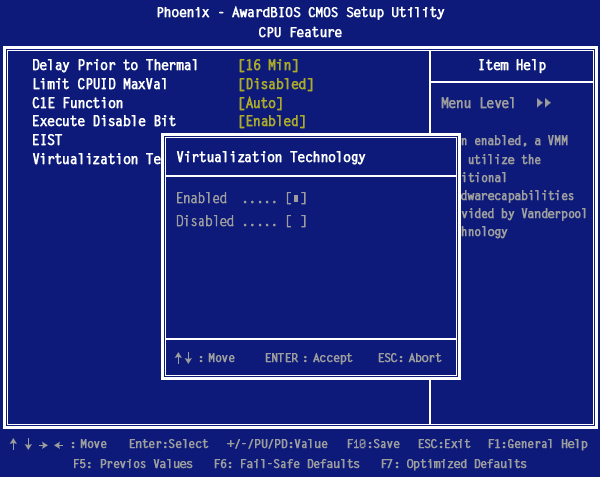
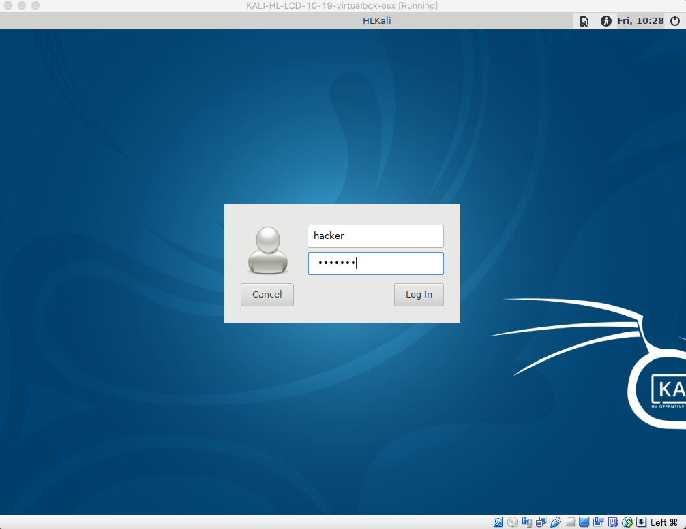
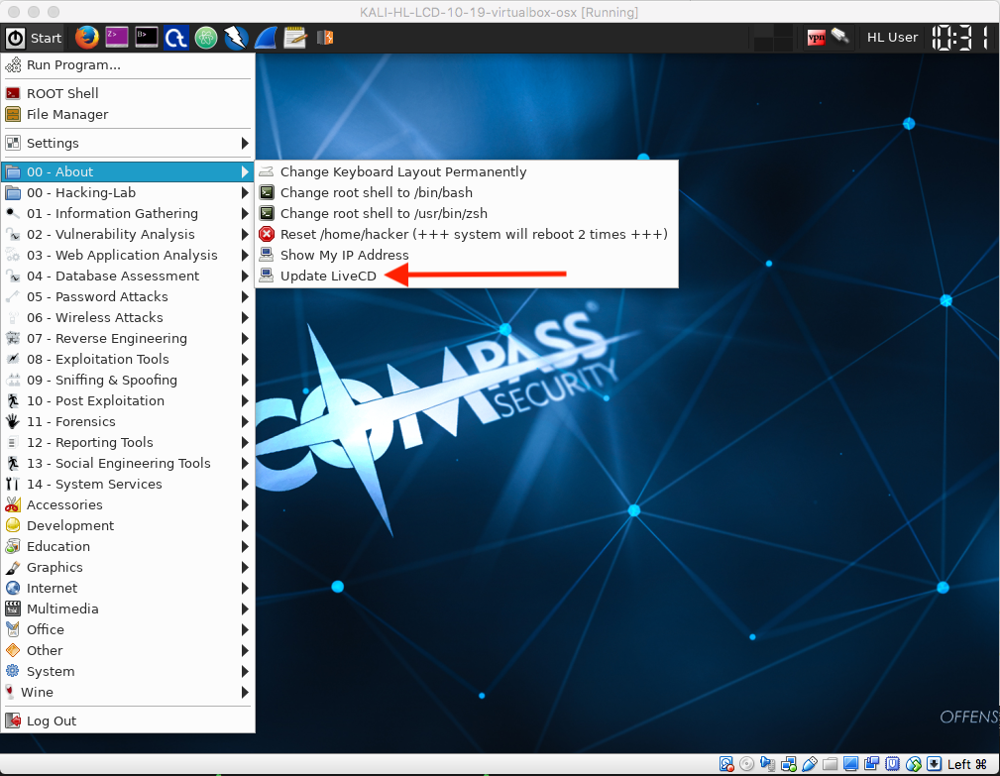
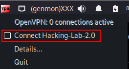
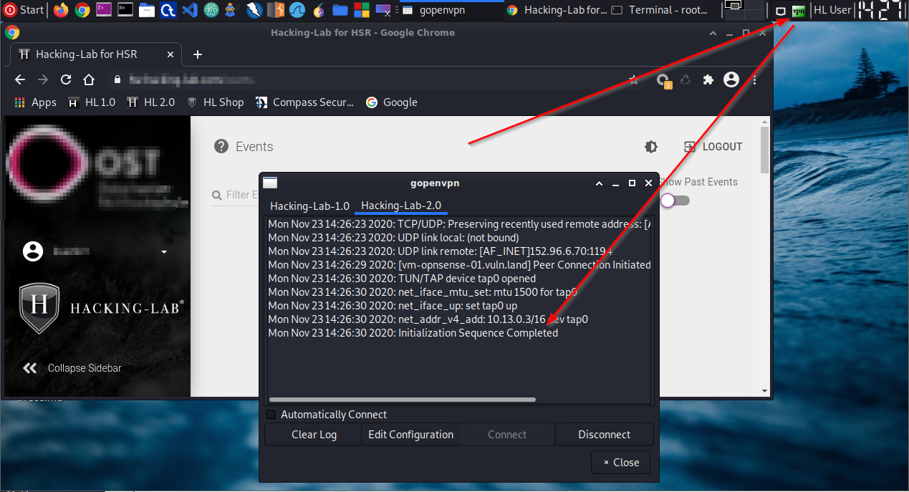

# Installation Kookarai Pentesting Linux
## Einleitung
Dieser Guide unterstützt Sie bei der Installation der Hacking-Lab Kookarai Pentesting Linux auf Ihren Laptop oder Computer. Kookarai wird benötigt, um eine VPN Verbindung ins Hacking-Lab aufzubauen und basiert auf einem 64-Bit Kali Linux System. Darüber hinaus ist Kookarai für diverse Übungen im Hacking-Lab optimiert und vorbereitet. Sie benötigen ein 64-Bit Laptop, damit Kookarai korrekt funktioniert.

## Voraussetzung
Damit Kookarai auf Ihrem Computer genutzt werden kann, muss die Hypervisor Funktion im BIOS von Ihrem PC aktiviert sein. Bitte stellen Sie dies zuerst sicher, ansonsten lässt sich Kookarai nicht starten.

## Installation VirtualBox
Bitte laden Sie von https://www.virtualbox.org die neueste VirtualBox Software für Ihr Betriebssystem herunter. Folgen Sie der Installationsanleitung auf der Webseite. Für die Installation sind Administrator Rechte notwendig.

## Download Hacking-Lab OVA
Bitte laden Sie von https://livecd.hacking-lab.com/ die OVA Datei herunter. Stellen Sie sicher, dass Sie die korrekte Version herunterladen. Prüfen Sie nach dem Download, dass die Datei die Dateiendung "ova" aufweist. Sollte sie "zip" sein, benennen Sie die Datei auf "ova" um.

## Import Kookarai in VirtualBox
Bitte starten Sie VirtualBox und drücken Sie die Tasten "CTRL + I". Sie werden aufgefordert den Pfad anzugeben, wo sich die "ova" Datei befindet. Wählen Sie diese aus und bestätigen Sie die Eingabe. Sie können die Import Funktion auch via Menü über Datei -> Appliance Importieren starten. Nach ein paar Minuten "Import" steht Ihnen Kookarai Pentesting Linux in VirtualBox zur Verfügung.

## Starten Kookarai
Bitte starten Sie Kookarai in VirtualBox. Es dauert ein paar Minuten und anschliessend werden Sie aufgefordert, einen Benutzername und Passwort einzugeben. Bitte verwenden Sie folgende Angaben:

Benutzername = hacker
Passwort = compass

Nach dem ersten Login sehen Sie die graphische Oberfläche von Kookarai Pentesting Linux.

## Sprache der Tastatur
Die Tastatur in Kookarai ist standardmässig auf US English eingestellt. Sie können die Tastatur bequem über einen Menü Eintrag verändern. Beispielsweise für Schweizerdeutsch:

1. Klicken Sie auf Start (oben links)
2. Klicken Sie auf 00-About
3. Klicken Sie auf Change-Keyboard-Layout-Permanently

Ein neues Fenster erscheint. Geben Sie dort "ch" ein und betätigen Sie die ENTER Taste. Nun ist ihre Kookarai auf Schweiz eingestellt, auch wenn Sie Kookarai neu starten.

## Updates Kookarai

Bitte aktualisieren Sie Kookarai von Zeit zu Zeit. Hierfür gibt es einen Menü Eintrag, über welchen Sie die Kookarai aktualisieren können. Eine Internet Verbindung wird hierfür vorausgesetzt.

1. Klicken Sie auf Start (oben links)
2. Klicken Sie auf 00-About
3. Update Kookarai

Da Kali Linux viele Updates bringt, müssen Sie ca. 5-15 Minuten dafür einrechnen. Sie können während dem Update in Kookarai weiter arbeiten.

## Mauszeiger
Drücken Sie die CTRL Taste auf der rechten Seite von Ihrer Tastatur, wenn Sie den Mauszeiger aus der VirtualBox befreien möchten.

## Copy / Paste
Kookarai sollte so eingestellt sein, dass Sie mit Copy und Paste arbeiten können. Falls Sie Probleme mit Copy und Paste haben, so kann man die Funktion in VirtualBox gesondert freischalten. Bitte prüfen Sie die Einstellungen unter VirtualBox unter "Gerät" (Gemeinsame Zwischenablage) und (Drag und Drop)

## VPN
Um auf die verwundbaren Systeme im Hacking-Lab Netzwerk zugreifen zu können, müssen Sie eine VPN Verbindung zu diesem aufbauen. Sie sehen oben rechts im Menü ein VPN Icon. Bitte klicken Sie mit der rechten Maustaste auf das VPN Icon und wählen Sie "Connect Hacking-Lab-2.0". 

und Sie sind verbunden.

