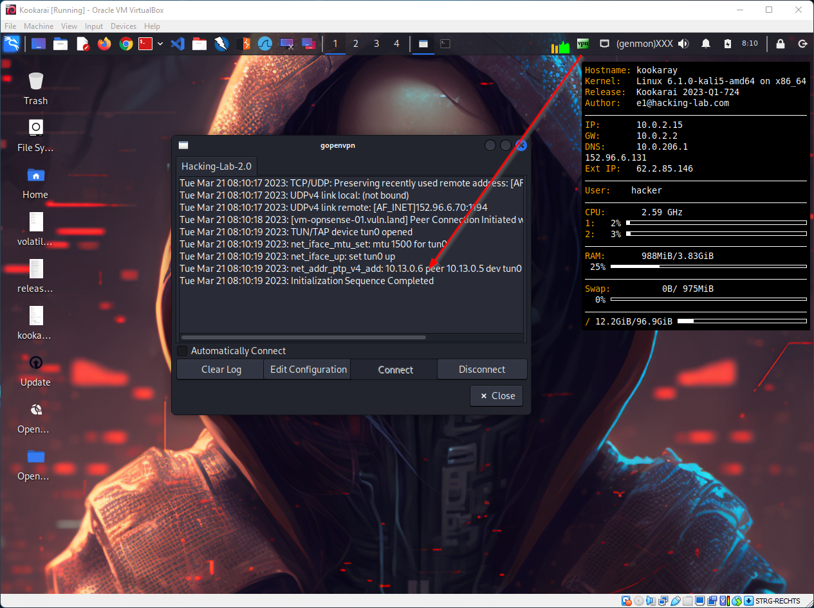

# Installing Hacking-Lab Kookarai Pentesting Linux
## Introduction
This guide will help you install the Hacking-Lab Kookarai Pentesting Linux on your laptop or computer. Kookarai is needed to establish a VPN connection to the Hacking-Lab and is based on a 64-bit Kali Linux system. Furthermore, the Kookarai Pentesting Linux is optimized and prepared for various exercises in Hacking Lab. You need a 64-bit laptop for Kookarai to work correctly.

## Pre-requirement
To use Kookarai on your computer, the hypervisor feature in the BIOS must be activated on your PC. Please ensure this first, otherwise Kookarai will not start.

## Install VirtualBox
Please download the latest VirtualBox software for your operating system from https://www.virtualbox.org. Follow the installation instructions on the website. Administrator rights are required for installation.

## Download Hacking-Lab OVA
Please download the OVA file for Windows or macOS from https://livecd.hacking-lab.com/. After downloading, check that the file has the file extension "ova". If it is "zip", rename the file to "ova".

## Import Kookarai into VirtualBox
Please start VirtualBox and press the "CTRL + I" keys. You will be prompted for the path where the "ova" file is located. Select it and confirm your entry. You can also start the import function via menu File -> Appliance Import. After a few minutes of "Import", Kookarai is available in VirtualBox.

## Launch Kookarai
Please start Kookarai in VirtualBox. It will take a few minutes and then you will be asked to enter a user name and password. Please use the following information:

Username = hacker
Password = compass

After the first login you will see the graphical user interface of Kookarai Pentesting Linux.

## Language / layout of the keyboard
The keyboard on Kookarai is set to US English layout. You can conveniently change the keyboard via a menu item. For example, for Swiss-German:

1. click on Start (top left)
2. click on 00-About
3. click on Change-Keyboard-Layout-Permanently

A new window appears. Enter "ch" and press the ENTER button. Now your Kookarai is set to Swiss-german layout, even if you restart Kookarai.

## Updates Kookarai
Please update Kookarai from time to time. There is a menu entry for this, via which you can update Kookarai. An Internet connection is required.

1. Click on Start (top left)
2. Click on 00-About
3. Update Kookarai

Since Kali Linux delivers updates frequently and numerously, you have to allow about 5-15 minutes for it. You can continue working in your Kookarai during the update.

## Mouse pointer
Press the CTRL key on the right side of your keyboard if you want to free the mouse pointer from VirtualBox.

## Copy / Paste
Kookarai should be set so that you can work with copy and paste. If you have problems with Copy and Paste, you can activate the function in VirtualBox separately. Please check the settings under VirtualBox under "Device" (Shared Clipboard) and (Drag and Drop)

## VPN
To access the vulnerable systems in the Hacking Lab, you need to establish a VPN connection with Hacking Lab. You will see a VPN icon in the top right corner of the taskbar. Please right-click on the VPN icon and select "Connect Hacking-Lab-2.0". 

and finally...

