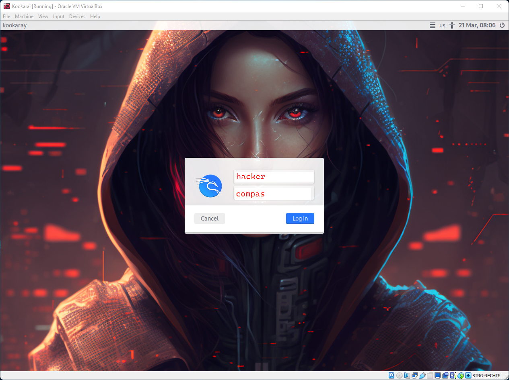
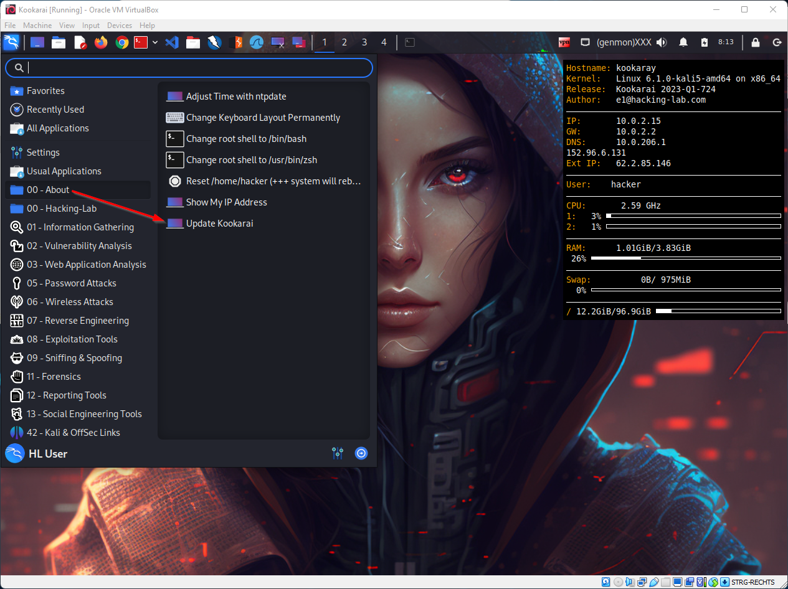
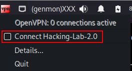

# Installing Hacking-Lab LiveCD
## Introduction
Ce guide vous aidera à installer le LiveCD Hacking-Lab sur votre ordinateur portable ou ordinateur. Le LiveCD est nécessaire pour établir une connexion VPN avec le Hacking-Lab et est basé sur un système Linux Kali 64 bits. De plus, le LiveCD est optimisé et préparé pour divers exercices dans le Hacking Lab. Vous avez besoin d'un ordinateur portable 64 bits pour que le LiveCD fonctionne correctement.

## Pré-requis
Pour utiliser le LiveCD sur votre ordinateur, la fonction hyperviseur du BIOS doit être activée sur votre PC. Veuillez vous en assurer d'abord, sinon le LiveCD ne démarrera pas.

## Installer VirtualBox
Veuillez télécharger la dernière version du logiciel VirtualBox pour votre système d'exploitation sur http://www.virtualbox.org Suivez les instructions d'installation sur le site Web. Les droits d'administrateur sont requis pour l'installation.

## Télécharger Hacking-Lab OVA
Veuillez télécharger le fichier OVA pour Windows ou OSX à partir de https://livecd.hacking-lab.com/ . Après le téléchargement, vérifiez que le fichier porte l'extension "ova". Si c'est "zip", renommez le fichier en "ova".

## Importer des LiveCD dans VirtualBox
Démarrez VirtualBox et appuyez sur les touches "CTRL + I". Vous serez invité à indiquer le chemin d'accès où se trouve le fichier "ova". Sélectionnez-le et confirmez votre saisie. Vous pouvez également lancer la fonction d'importation via le menu Fichier -> Importation d'appareils. Après quelques minutes d'"Import", le LiveCD est disponible dans VirtualBox.

## Lancez LiveCD
Veuillez démarrer le LiveCD dans VirtualBox. Cela prendra quelques minutes, puis on vous demandera d'entrer un nom d'utilisateur et un mot de passe. Veuillez utiliser les informations suivantes :

Nom d'utilisateur = hacker
Mot de passe = compass

Après la première connexion, vous verrez l'interface graphique du LiveCD Hacking-Lab.

## Langue du clavier
Le clavier du LiveCD est réglé sur US English. Vous pouvez facilement changer le clavier à l'aide d'un élément de menu. Par exemple, pour Swiss-Allemand :

1. cliquez sur Démarrer (en haut à gauche)
2. cliquez sur 00-A propos de
3. cliquez sur Change-Keyboard-Layout-Permanemment.

Une nouvelle fenêtre apparaît. Entrer "ch" et appuyer sur la touche ENTER. Maintenant, votre LiveCD est réglé sur Suisse, même si vous redémarrez le LiveCD.

## Mises à jour LiveCD
Veuillez mettre à jour votre LiveCD de temps en temps. Pour cela, il existe une entrée de menu qui vous permet de mettre à jour le LiveCD. Une connexion Internet est nécessaire.

1. cliquez sur Démarrer (en haut à gauche)
2. cliquez sur 00-A propos de
3. cliquez sur Update LiveCD

Puisque Kali Linux apporte beaucoup de mises à jour, vous devez allouer environ 5-10 minutes pour cela. Vous pouvez également continuer à travailler dans votre LiveCD pendant la mise à jour.

## Pointeur de souris
Appuyez sur la touche CTRL sur le côté droit de votre clavier si vous voulez libérer le pointeur de la souris de la VirtualBox.

## Copier / Coller
Le LiveCD doit être configuré de façon à ce que vous puissiez travailler avec copier-coller. Si vous avez des problèmes avec Copier et Coller, vous pouvez activer la fonction dans VirtualBox séparément. Veuillez vérifier les paramètres sous VirtualBox sous "Device" (Shared Clipboard) et (Drag and Drop).

## VPN
Pour accéder aux systèmes vulnérables du laboratoire de piratage, vous devez établir une connexion VPN avec le laboratoire de piratage. Vous verrez une icône VPN dans le coin supérieur droit du menu. Cliquez avec le bouton droit de la souris sur l'icône VPN et sélectionnez "Connect Hacking-Lab". Vous devez entrer un nom d'utilisateur et un mot de passe. Veuillez ouvrir un compte sur https://www.hacking-lab.com/ et utiliser exactement le même nom d'utilisateur (e-mail) et le mot de passe que vous avez choisi pour le VPN.

