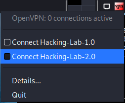

# OpenVPN
## Introduction
Hacking-Lab 2.0 introduces an OpenVPN gateway. This is useful when testing reverse shells from the vulnerable systems to the students computer. 

## Pre-Requirement
Please be aware, you **MUST** be authenticated with your browser in one of the Hacking-Lab 2.0 applications, `before VPN access will be granted`!

## LiveCD VPN Client
The latest LiveCD has the new HL2.0 OpenVPN gateway `pre-configured`. If you right-click on the OpenVPN icon in the upper right corner of the xfce4 desktop, you can connect to the HL2.0 VPN gateway very easily without entering `username` and `password`. 




If you did authenticate in one of the HL 2.0 web application `prior` opening VPN, your connection will establish and the icon will turn `green`. See the screenshot below for your reference. 


## Manual Configuration
For those who want to setup VPN manually, please use the following config settings

```
client

dev tap

proto udp
remote 152.96.6.70
port 1194
nobind

cipher AES-256-CBC
auth SHA256
auth-nocache
auth-user-pass

auth-user-pass Hacking-Lab-2.0.credentials


persist-key
persist-tun

remote-cert-tls server
tls-client
ca vuln.land_ca_chain.crt
```

You will find `Hacking-Lab-2.0.credentials` and `land_ca_chain.crt` in this repo. 

[Repo Files](./)


**IMPORTANT** we will change the HL PW regurarely and keep this repo updated with the recent password. 


